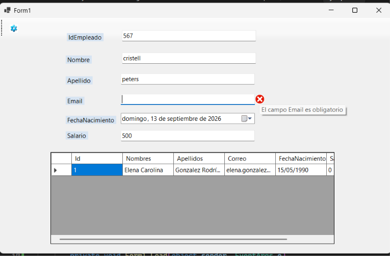
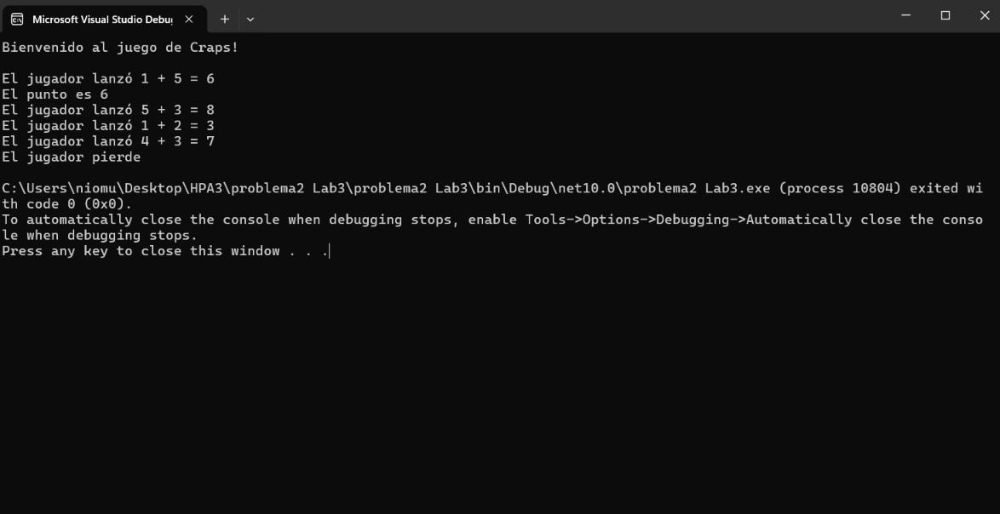
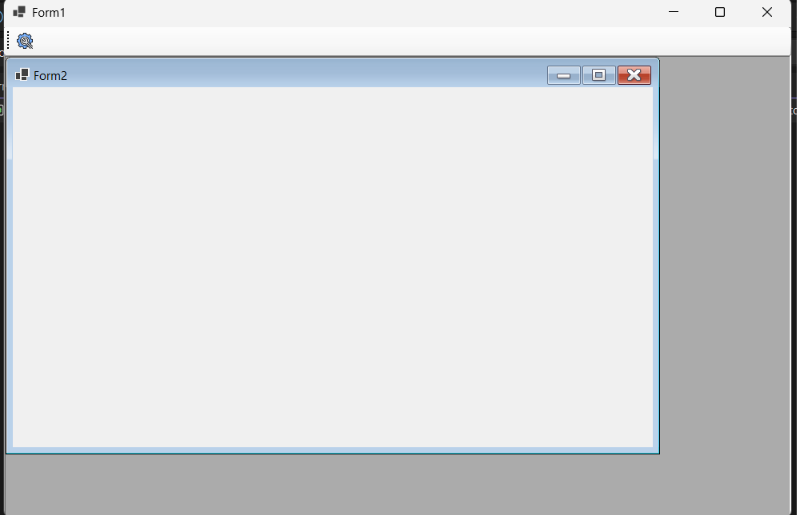

# Laboratorio 3 - HPA3

## Información del laboratorio

| Dato | Información |
|---|---|
| **Laboratorio** | Laboratorio #3 |
| **Tema** | Laboratorio de Validaciones, Métodos Estáticos |
| **Estudiante** | Cristell Peters |
| **Grupo** | 1IL133 |
| **Año** | 2026 |
| **Fecha de entrega** | 13/09/2026 |

---

## Objetivos

🩷 Diseñar clases orientadas a objetos aplicando los principios de encapsulamiento, propiedades y modularidad.

🩷 Desarrollar aplicaciones de escritorio utilizando Windows Forms y diferentes controles para la interacción con el usuario.

🩷 Trabajar con colecciones de objetos y mostrar la información mediante componentes como `DataGridView`.

🩷 Implementar validaciones para controlar los datos ingresados por el usuario.

🩷 Utilizar clases auxiliares y métodos de C# para organizar la lógica de las aplicaciones.

🩷 Implementar una estructura de navegación mediante formularios MDI.

---

## Contenido del laboratorio

En este laboratorio se trabajaron diferentes conceptos de programación orientada a objetos y desarrollo de aplicaciones de escritorio utilizando C# y Windows Forms.

Durante las actividades se utilizaron clases, objetos, propiedades, encapsulamiento y colecciones para almacenar información. También se trabajó con controles de Windows Forms como `DataGridView`, `ErrorProvider` y `ToolStrip`, además de métodos de validación como `decimal.TryParse` y expresiones regulares mediante `Regex`.

También se implementó una interfaz MDI, utilizando un formulario principal como contenedor de otros formularios. De esta manera, los ejercicios permitieron aplicar los conceptos vistos en clase mediante ejemplos prácticos.

---

## Tecnologías utilizadas

🩷 **Lenguaje:** C#

🩷 **Plataforma:** .NET Framework

🩷 **Tipo de aplicación:** Windows Forms

🩷 **IDE:** Visual Studio

---

## Requisitos previos

Para ejecutar los proyectos se necesita:

🩷 Windows.

🩷 Visual Studio.

🩷 Soporte para proyectos de C# Windows Forms.

🩷 .NET Framework correspondiente a los proyectos.

---

# Problemas desarrollados

## 1. Registro y validación de personas

En este problema se desarrolló un formulario en Windows Forms para registrar información de una persona y mostrar los datos ingresados en un `DataGridView`.

Para organizar la información se utilizó una clase `Persona`, en la cual se definieron propiedades como el identificador, nombres, apellidos, correo, salario y fecha de nacimiento. De esta forma, cada registro puede manejarse como un objeto con sus propios datos.

El formulario permite ingresar la información mediante diferentes controles. Antes de crear el objeto `Persona`, se realizan validaciones para comprobar que los datos introducidos sean correctos. Para los campos de texto se verifica que no estén vacíos, mientras que el correo electrónico se valida mediante una clase de utilidades y el salario se convierte utilizando `decimal.TryParse`.

Una vez que los datos son validados correctamente, se crea un nuevo objeto `Persona` y se agrega a la colección de personas. Finalmente, la información de la colección se asigna al `DataGridView` para mostrar los registros en forma de tabla.

Este ejercicio permitió aplicar el uso de clases y objetos junto con controles de Windows Forms, colecciones, validaciones y visualización de información.

### Evidencia



---

## 2. Uso de List<Persona> en lugar de ArrayList

En este problema se trabajó con una colección de objetos `Persona` y con un `DataGridView` para mostrar la información almacenada en la aplicación.

Inicialmente, la colección utilizada para almacenar las personas era un `ArrayList`.

```csharp
using System.Collections;

// Declaración inicial
ArrayList listaPersonas = new ArrayList();
```

El principal inconveniente de `ArrayList` es que sus elementos se almacenan como `object`. Esto significa que aunque se agreguen objetos de tipo `Persona`, la colección no está definida específicamente para trabajar con ese tipo de objeto. Por esta razón, al recuperar los elementos puede ser necesario realizar conversiones para volver a trabajar con ellos como objetos `Persona`.

Además, `ArrayList` permite almacenar diferentes tipos de objetos dentro de la misma colección. Esto hace que exista una menor seguridad de tipos y que algunos errores solamente puedan detectarse durante la ejecución del programa.

### Modificación realizada

Para mejorar la implementación se reemplazó `ArrayList` por una colección genérica utilizando `List<Persona>`.

El código inicial:

```csharp
using System.Collections;

ArrayList listaPersonas = new ArrayList();
```

se modificó por:

```csharp
using System.Collections.Generic;

List<Persona> listaPersonas = new List<Persona>();
```

Con este cambio, la colección queda definida específicamente para almacenar objetos de tipo `Persona`. Por lo tanto, el programa tiene un mayor control sobre los datos que pueden agregarse a la lista.

El uso de `List<Persona>` también hace que el código sea más claro, ya que los elementos de la colección se manejan directamente como objetos `Persona`, evitando las conversiones que podían ser necesarias con `ArrayList`.

Esta modificación mejora la seguridad de tipos y hace que la colección sea más adecuada para el manejo de los registros utilizados por el formulario y el `DataGridView`.

### Comparación

| Componente | Código inicial | Código modificado |
|---|---|---|
| **Librería** | `System.Collections` | `System.Collections.Generic` |
| **Colección** | `ArrayList` | `List<Persona>` |
| **Tipo de elementos** | `object` | `Persona` |
| **Seguridad de tipos** | Menor | Mayor |
| **Conversiones** | Pueden ser necesarias | Se reducen |

### Evidencia



---

## 3. Formulario MDI en C#

En este ejercicio se implementó un formulario MDI (Multiple Document Interface) utilizando Windows Forms y C#. La finalidad fue crear un formulario principal que pudiera contener otros formularios dentro de su propia ventana.

Para esto se configuró `Form1` como el formulario principal de la aplicación y `Form2` como formulario hijo. El formulario principal funciona como contenedor y permite abrir el formulario secundario dentro de él.

Para que `Form1` pueda funcionar como contenedor MDI se utiliza la propiedad `IsMdiContainer`. Esta propiedad permite que otros formularios puedan establecerlo como su formulario padre.

Al momento de abrir `Form2`, se utiliza la propiedad `MdiParent` para establecer la relación entre ambos formularios. De esta forma, `Form2` se muestra dentro de `Form1` y forma parte de la interfaz principal de la aplicación.

### Control de formularios abiertos

Además de implementar la estructura MDI, se utilizó `Application.OpenForms` para comprobar si `Form2` ya se encuentra abierto.

La finalidad de esto es evitar que se abran varias instancias del mismo formulario. Cuando se selecciona la opción para abrir `Form2`, primero se comprueba si ya existe una instancia abierta.

Si `Form2` todavía no está abierto, se crea una nueva instancia y se establece `Form1` como su formulario padre mediante `MdiParent`.

Si `Form2` ya se encuentra abierto, no se crea una nueva ventana. En su lugar, se utiliza `BringToFront()` para llevar el formulario existente al frente y `Focus()` para establecer nuevamente el foco sobre él.

De esta manera, se evita la duplicación de ventanas y se permite que el usuario pueda regresar al formulario que ya se encontraba abierto.

### ToolStrip

Para realizar las acciones de navegación se utilizaron eventos asociados a los controles de `ToolStrip`. Estos eventos permiten ejecutar las instrucciones correspondientes cuando el usuario selecciona una opción de la barra de herramientas.

Con esta implementación, `Form1` funciona como ventana principal y `Form2` puede abrirse como formulario hijo dentro de la interfaz MDI. Además, el uso de `Application.OpenForms`, `BringToFront()` y `Focus()` permite controlar la apertura de las ventanas y evitar formularios duplicados.


### Evidencia



---
